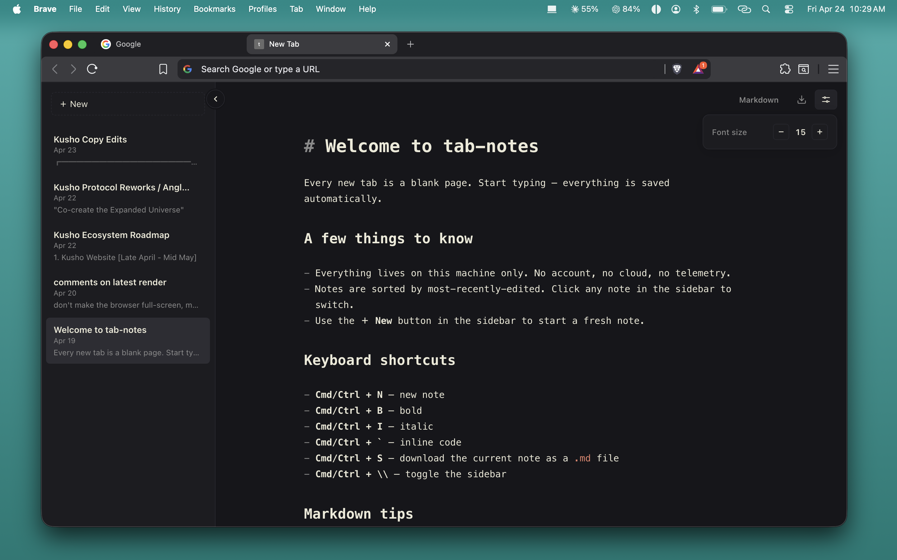

# tab-notes



A minimalist Markdown editor that replaces Chrome's New Tab page with a private, local-first writing space.

[Install](#install) · [Shortcuts](#shortcuts) · [Roadmap](./ROADMAP.md) · [Releases](https://github.com/joe-josue/tabnotes/releases) · [Support](#support)

## Why

Most new tabs are dead space: search bars, shortcut grids, or a blank screen that does nothing for you.

`tab-notes` turns that moment into a writing surface. Open a new tab and start typing immediately. No account, no sync setup, no dashboard, no startup friction.

Built for people who want somewhere fast to think, draft, jot, or park a note without leaving the browser.

## Features

- Replaces Chrome's New Tab page with a focused Markdown editor
- Live markdown styling — headings, bold, italic, code render as you type
- Saves notes locally — no account, no cloud, no telemetry
- Collapsible sidebar with recent notes and quick switching
- Adjustable font size, plain-text mode, light and dark themes
- Exports the current note as `.md` or `.txt` straight to Downloads
- Full keyboard shortcut coverage — rarely need the mouse

## Install

### Option A — Download and install (no build step)

1. Go to the [latest release](https://github.com/joe-josue/tabnotes/releases/latest)
2. Download `tab-notes-v*.zip` under Assets
3. Unzip it — you'll get a `dist/` folder
4. Open `brave://extensions` or `chrome://extensions`
5. Turn on **Developer mode** (top-right toggle)
6. Click **Load unpacked** and select the unzipped folder

Open a new tab. You should land directly in the editor.

### Option B — Build from source

```bash
git clone https://github.com/joe-josue/tabnotes.git
cd tabnotes
npm install
npm run build
```

Then load the `dist/` folder as an unpacked extension (steps 4–6 above).

## Development

```bash
npm install
npm run dev
```

## Shortcuts

| Action | Shortcut |
|--------|----------|
| New note | `Cmd/Ctrl + N` |
| Bold | `Cmd/Ctrl + B` |
| Italic | `Cmd/Ctrl + I` |
| Inline code | `Cmd/Ctrl + \`` |
| Download note | `Cmd/Ctrl + S` |
| Toggle sidebar | `Cmd/Ctrl + \` |
| Indent | `Tab` |
| Unindent | `Shift + Tab` |

## Storage

All notes live in `chrome.storage.local`.

- No cloud
- No account
- No telemetry

## Status

`active` — shipping regularly. See [PATCH-NOTES.md](./PATCH-NOTES.md) for what's changed and [ROADMAP.md](./ROADMAP.md) for what's coming.

## Support

- If `tab-notes` helped you, give it a star and share it with someone who writes in the browser.
- Interested in building something similar for yourself or your business? I do selected 0-1 product and implementation consulting.
- For collaboration or consulting inquiries, email `mail@joejosue.com`.
